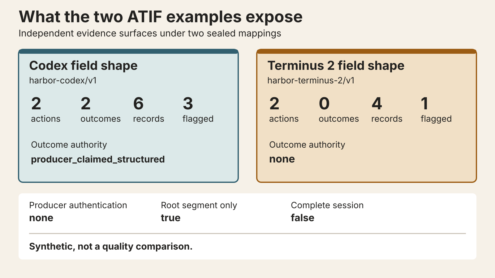

# SalienceGate

SalienceGate is a Python library for testing when an agent may need a memory reminder. It reads
event streams or supported ATIF traces, runs deterministic detectors, and produces an auditable
report. In Shadow Mode it never calls a model or changes the agent's behavior.

It is not a memory database. Existing vector stores, graph memories, code indexes, and journals can
remain where they are; SalienceGate studies the narrower question of when memory work may be worth
considering. The research starts from
[Remember When It Matters](https://arxiv.org/abs/2607.08716) and adds event-driven invocation,
explicit budgets, grounded reminders, replay, and evidence boundaries.

Build with it: [run the local path](#try-it-locally), then
[analyze a trajectory](#analyze-a-trajectory).

Study it: [inspect the measured examples](#what-the-examples-show), then
[reproduce the research](#reproduce-the-research).

## Try it locally

The offline demo regenerates a 32-case synthetic diagnostic in memory. Installing dependencies may
contact a package index; the demo itself opens no socket, reads no provider credential, calls no
model, and writes no artifact.

Artifact-compatible after installation:

```bash
saliencegate demo
```

Run from a checkout:

```bash
uv sync --locked --no-dev
uv run --locked --no-dev saliencegate demo
```

The human output ends with 32 passed oracle checks and a deterministic digest. JSON output from
`saliencegate demo --json` fixes the boundary in machine-readable fields:
`evidence_level: synthetic_diagnostic`, `confirmatory: false`, and
`external_claims_supported: false`. This exercises mechanics, not agent task performance.

## Analyze a trajectory

Shadow Mode accepts native `shadow-input/v1` NDJSON or one ATIF JSON document under the sealed
`harbor-codex/v1` and `harbor-terminus-2/v1` mappings. Input is parsed as data and never executed.
For the CLI example, place the source in an owner-only `.saliencegate-shadow` directory as a
single-link file with mode `0600`.

Artifact-compatible after installation:

```bash
saliencegate shadow analyze .saliencegate-shadow/events.ndjson \
  --run-id b35f05f3-555b-4f09-8996-a7b3693bb54a \
  --output .saliencegate-shadow/shadow-report.json \
  --json
```

Run from a checkout:

```bash
uv run --locked python examples/shadow_asyncio.py
uv run --locked python examples/atif-shadow/one_call.py
```

The Python surface lives in `saliencegate.shadow`; use `ShadowSession` for incremental events and
`analyze_atif_bytes` for one bounded ATIF trace. The current release implements four of the nine
detector types: `repeated_action`, `repeated_failure`, `test_failure`, and `tool_error`. A submitted
event receives one baseline disposition: `flagged`, `not_flagged`, `indeterminate`, or
`not_applicable`. Unsupported detector types stay explicit instead of being counted as abstentions.

Every report is `descriptive_observational`. It records zero model calls, budget reservations,
memory revisions, interventions, and deliveries, and it has no decision authority. The complete
input, resume, report, and security contracts are in the
[Shadow Mode reference](docs/reference/shadow-mode.md).

## What happens inside


The analyzer seals the selected input mapping before adaptation. It redacts bounded fields, runs
detectors with typed outcomes and explicit abstentions, and appends only the missing exact suffix to
an authenticated local ledger. When the complete trace already matches the authenticated prefix,
the ledger append is a no-op; preflight and report construction still run. The final report binds
its source, configuration, observations, and ledger state by digest. The ledger is authenticated;
the report is content-addressed, not authenticated. Neither grants the analyzer authority over the
agent's next action.

This separation matters when comparing policies: observation can run beside an existing agent
without silently becoming an intervention. Any later reminder path must separately reserve budget,
validate evidence, authorize one delivery, and record its outcome.

## What the examples show



The public Codex-shaped example maps two actions and two producer-claimed structured outcomes into
six records; three records are flagged. The Terminus 2 shape maps two actions and no outcome text
into four records; one is flagged. Both select only the root trajectory segment, declare no producer
authentication, and do not claim complete session coverage. They are synthetic field-shape tests,
not a comparison of agents or providers. The exact inputs and commands are in the
[ATIF example guide](examples/atif-shadow/README.md).


Sources: [reference JSON](benchmarks/shadow_trace/reference-macos-26.5.2-arm64-cpython-3.12.3.json),
[evidence manifest](benchmarks/shadow_trace/reference-macos-26.5.2-arm64-cpython-3.12.3.manifest.json),
and the [complete text table](docs/benchmarks/foundation-evidence.md).

Run from a checkout:

```bash
uv --cache-dir /private/tmp/saliencegate-uv-cache run --python 3.12.3 --locked \
  python scripts/benchmark_shadow_trace.py --assert-budgets
```

On that one macOS machine, five isolated 1,000-record runs produced medians of 4.719111875 seconds
for memory and 7.412707417 seconds for SQLite, within budgets of 5 and 15 seconds. Peak RSS stayed
within the 512 MiB budget. These numbers are a reproducible local reference, not a cross-machine,
provider-latency, or agent-quality claim.

## Use SalienceGate

For a new integration, begin with Shadow Mode and keep its report outside the action prompt. Feed it
normalized lifecycle events through `ShadowSession`, or adapt a supported ATIF trace with an
explicit profile, working directory, environment digest, and run ID. Add durable SQLite resume only
when exact-prefix recovery matters. The runnable
[`asyncio` example](examples/shadow_asyncio.py) shows the smallest incremental session.

The intervention runtime is separate. It offers deterministic signal extraction, invocation policy
and budget enforcement, recoverable memory cycles, citation-only proposal validation, bounded
template rendering, one-decision delivery, outcome accounting, replay, and artifact validation.
Read the [CLI reference](docs/reference/cli.md) and
[artifact reference](docs/reference/artifacts.md) before wiring those paths into a larger system.

## Reproduce the research

Run from a checkout:

```bash
uv run --locked pytest tests/experiments tests/cli/test_algorithm.py
install -d -m 700 .artifacts
uv run --locked saliencegate-review build-pack \
  --output .artifacts/state-decay-v2-review-pack \
  --json
```

The first command covers the frozen source-paper algorithm path and offline comparison conditions.
The review command deterministically builds 180 candidates and 900 outcome-free previews across six
visible families. The human review gate remains closed: the repository contains review tooling, not
accepted public outcomes or a benchmark result. Publication warnings, append-only corrections, and
the acceptance gate are defined in the
[StateDecayBench v2 review guide](docs/reference/state-decay-v2-review.md).

## Available today

| Surface | Current evidence |
|---|---|
| Package, ledgers, policies, replay, CLI, and artifacts | Deterministic offline tests |
| Native and ATIF Shadow analysis | Synthetic and sanitized field-shape evidence |
| Source-paper fixed-step path and baselines | Frozen offline replay |
| StateDecayBench v2 candidate and review tooling | Pack construction verified; human review incomplete |
| OpenAI-compatible local pilot adapter | Implemented; no committed live result |

The package has not been published. Build and inspect the wheel from this checkout before installing
it elsewhere.

## Limits

- Synthetic diagnostics and field-shape examples do not establish task efficacy or comparative
  performance.
- Shadow detectors are deterministic heuristics; five declared signal types remain unsupported and
  the event-driven trigger is not calibrated from paired task evidence.
- HMAC protects ledger integrity but does not encrypt stored plaintext or prevent rollback to an
  older internally valid database without an external monotonic anchor.
- Secure artifact publication relies on POSIX directory-descriptor and directory-fsync behavior;
  Windows is not currently verified.
- The tracked benchmark is one machine-bound reference. Large or highly contended SQLite stores
  need measurements in their own deployment environment.

## Development

Run from a checkout:

```bash
uv sync --locked --all-extras --dev --no-install-project
uv sync --locked --all-extras --dev --no-build-isolation
make check
make build
make artifact-smoke
```

Contributor expectations are in [CONTRIBUTING.md](CONTRIBUTING.md). Report suspected credential
exposure or integrity failures through [SECURITY.md](SECURITY.md), not a public issue.

## Citation

Software citation metadata is available in [CITATION.cff](CITATION.cff). Research claims and their
evidence levels are listed in [docs/research-claims.md](docs/research-claims.md).

## License

Licensed under the [Apache License 2.0](LICENSE).
