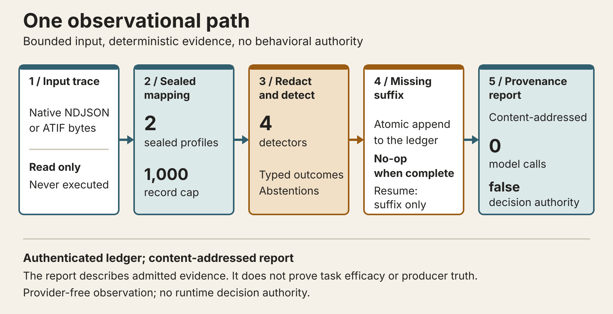
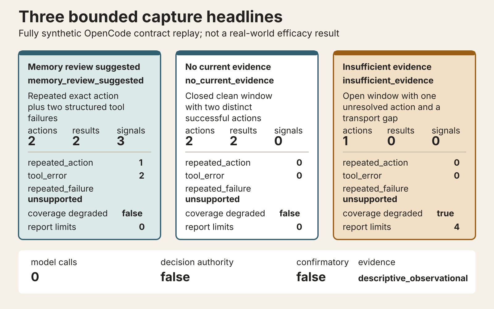
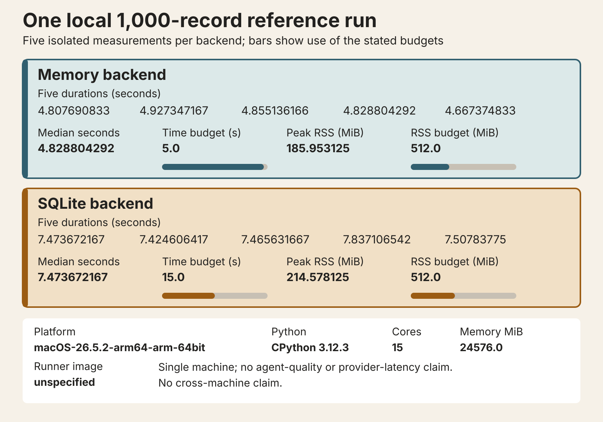

# SalienceGate

SalienceGate passively observes supported coding-agent lifecycle events and turns them into bounded,
content-free local evidence about when a memory review may be worth considering. Universal Shadow
Capture supports project-local integrations for Codex, Claude Code, OpenCode, and Pi. Capture calls
no model, reads no transcript, and cannot approve, block, retry, or modify an agent action.

It is not a memory database. Existing vector stores, graph memories, indexes, and journals can stay
where they are; SalienceGate addresses the narrower question of when memory work might deserve
review. The research starts from
[Remember When It Matters](https://arxiv.org/abs/2607.08716) and adds event-driven invocation,
explicit budgets, grounded reminders, replay, and evidence boundaries.

Build with it: [install the local wheel and connect one project](#try-it-locally), then
[inspect the captured evidence](#what-the-examples-show).

Study it: [analyze a bounded trace](#analyze-a-trajectory), then
[reproduce the research](#reproduce-the-research).

## Try it locally

Build and inspect the unpublished wheel; installing dependencies may contact an index. Choose an
installed `codex|claude-code|opencode|pi` provider and keep its project-trust checks enabled. The
dry-run reports managed files as ignored, Git-visible, or tracked without editing `.gitignore`.
This POSIX Codex example keeps the installed interpreter outside the target project, separating its
capture hook from project-controlled code:

Run from a checkout:

```bash
uv sync --locked --all-extras --dev --no-install-project
uv build
PROJECT="$PWD"
VENV="$HOME/.local/share/saliencegate/quickstart-venv"
install -d -m 700 "$(dirname "$VENV")"
uv venv "$VENV"
uv pip install --python "$VENV/bin/python" \
  dist/saliencegate-0.2.0-py3-none-any.whl
SG="$VENV/bin/saliencegate"
"$SG" connect codex --project "$PROJECT" --dry-run
"$SG" connect codex --project "$PROJECT"
"$SG" doctor --capture
# Run one Codex session after explicitly trusting this project.
"$SG" status codex --project "$PROJECT"
"$SG" sessions --limit 20
install -d -m 700 "$PROJECT/.saliencegate" "$PROJECT/.saliencegate/reports"
"$SG" report --latest --output "$PROJECT/.saliencegate/reports/capture-report.json"
"$SG" disconnect codex --project "$PROJECT"
```

`sessions` and `report` select the current project. `disconnect` removes the authenticated managed
integration but retains observations. Delete one session with `"$SG" delete SESSION_ID`, or first
disconnect every provider and use `"$SG" delete --all --project "$PROJECT" --confirm` for that
project's local records.

Only after a package is actually published would `uv tool install saliencegate` replace the
local-wheel installation above; selecting and pinning a reviewed public version remains an operator
decision. That command is not a statement that SalienceGate is available from a package index
today.

## Analyze a trajectory

Shadow Mode also accepts native `shadow-input/v1` NDJSON and one ATIF JSON document under the sealed
`harbor-codex/v1` or `harbor-terminus-2/v1` mapping. Input is parsed as data and never executed.

Artifact-compatible after installation:

```bash
saliencegate shadow analyze .saliencegate-shadow/events.ndjson \
  --run-id b35f05f3-555b-4f09-8996-a7b3693bb54a \
  --output .saliencegate-shadow/shadow-report.json --json
```

Run from a checkout:

```bash
uv run --locked python examples/shadow_asyncio.py
uv run --locked python examples/atif-shadow/one_call.py
```

The Python surface is `saliencegate.shadow`. The package implements four of the nine declared
detector types: `repeated_action`, `repeated_failure`, `test_failure`, and `tool_error`. Each event is
`flagged`, `not_flagged`, `indeterminate`, or `not_applicable`. Every report remains
`descriptive_observational`, with zero model calls, budget reservations, memory revisions,
interventions, and deliveries, and with no decision authority. See the
[Shadow Mode reference](docs/reference/shadow-mode.md).

## What happens inside



A connector admits only its audited lifecycle fields. Provider and call identifiers are reduced by
domain-separated HMAC before durable storage; prompts, responses, reasoning, tool arguments, and
tool output are excluded. The authenticated SQLite store and bounded fallback spool preserve local
receipt evidence. Maintenance commands drain the spool, verify the selected project and capability
manifest, normalize admitted records, run deterministic detectors, and build a canonical report.

Capture is observational. Provider IDs are same-user untrusted input, receipt timestamps are local
observations, and receipt order is not provider causal order. HMAC detects tampering with present
authenticated records while the key remains protected; it does not encrypt data, authenticate the
provider, or detect rollback to an older internally valid copy.

## What the examples show



The [capture example](examples/capture/README.md) freezes three synthetic contract cases. Repeated
exact action and structured failure evidence yields `memory_review_suggested`. A closed, clean
window with enough applicable evidence and no signal yields `no_current_evidence`. An open,
degraded, gapped, or otherwise incomplete window yields `insufficient_evidence`. These are report
headlines, not instructions or estimates of reminder usefulness. The fixture records zero
model calls, `confirmatory=false`, and `decision_authority=false`.



The tracked Shadow benchmark measured five isolated 1,000-record runs on one macOS arm64 machine.
Medians were 4.449103458 seconds in memory and 7.178122875 seconds with SQLite, within respective
5- and 15-second budgets; peak RSS remained under 512 MiB. See the
[reference JSON](benchmarks/shadow_trace/reference-macos-26.5.2-arm64-cpython-3.12.3.json) and
[evidence manifest](benchmarks/shadow_trace/reference-macos-26.5.2-arm64-cpython-3.12.3.manifest.json).
This is local engineering evidence, not provider latency or agent-quality evidence.

## Use SalienceGate

Start with `connect PROVIDER --dry-run`. After reviewing project-local changes, connect, exercise a
trusted provider session, and use `status`, `sessions`, and `report`. Status distinguishes an
installed connector from one that has actually been observed and exposes drift, queued or dropped
spool events, degraded sessions, and local byte counts without printing paths. Reports bind one
short SalienceGate session ID to detector support, denominators, exclusions, integrity state, and
one of the three headlines above. `feedback` can record an optional local human label; it never
activates behavior or exports a dataset.

Artifact-compatible after installation:

```bash
saliencegate status
saliencegate sessions --limit 20
```

Read the [CLI reference](docs/reference/cli.md),
[provider contract](docs/reference/integrations.md), [security model](docs/security.md), and
[evaluation boundary](docs/reference/evaluation.md) before collecting real data.

## Reproduce the research

Run from a checkout:

```bash
uv run --locked saliencegate demo --json
uv run --locked pytest tests/experiments tests/cli/test_algorithm.py
install -d -m 700 .artifacts
uv run --locked saliencegate-review build-pack \
  --output .artifacts/state-decay-v2-review-pack --json
```

The demo is a 32-case `synthetic_diagnostic` with `confirmatory: false` and
`external_claims_supported: false`. The review command builds 180 candidates and 900 outcome-free
previews across six visible families. The human review gate remains closed; this repository
contains review tooling, not accepted public outcomes or a benchmark result. See the
[StateDecayBench v2 review guide](docs/reference/state-decay-v2-review.md).

## Available today

| Surface | Current evidence |
|---|---|
| Four project-local capture connectors | Offline contract, fixture, packaging, and installed-artifact tests |
| Capture headlines and local feedback | Deterministic synthetic mechanics; insufficient real-world evidence |
| Native and ATIF Shadow analysis | Synthetic and sanitized field-shape evidence |
| Source-paper path and baselines | Frozen offline replay |
| StateDecayBench v2 review tooling | Pack construction verified; human review incomplete |

The native Ubuntu, Windows, and macOS connector jobs are prepared but have not been run remotely
from this unpublished branch. Remote verification remains a separate authorized gate.

## Limits

- Synthetic fixtures do not establish task efficacy, calibration, prevalence, or comparative
  performance.
- Capture covers only received events in audited provider surfaces; missing callbacks, crashes,
  unsupported tools, subagents, and version drift can make coverage incomplete.
- `no_current_evidence` requires a closed, clean, sufficiently observed window; it is not proof that
  memory was unnecessary.
- Local HMAC integrity is neither encryption nor whole-database rollback protection.
- The tracked performance reference is one machine; measure storage contention in each deployment.

## Development

```bash
uv sync --locked --all-extras --dev --no-install-project
uv sync --locked --all-extras --dev --no-build-isolation
make check
make build
make artifact-smoke
make connector-artifact-smoke
```

Contributor expectations are in [CONTRIBUTING.md](CONTRIBUTING.md). Report suspected credential
exposure or integrity failures through [SECURITY.md](SECURITY.md), not a public issue.

## Citation

Software citation metadata is in [CITATION.cff](CITATION.cff). Claims and evidence levels are in
[docs/research-claims.md](docs/research-claims.md).

## License

Licensed under the [Apache License 2.0](LICENSE).
