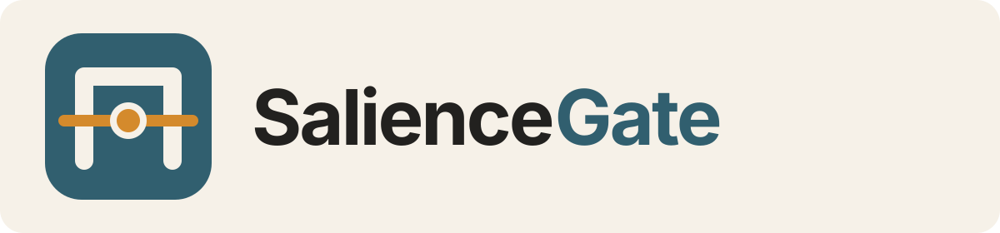
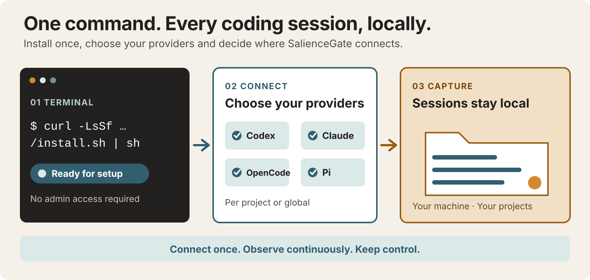

# SalienceGate



SalienceGate passively observes coding-agent lifecycle events and turns them into bounded local
evidence. It helps you inspect repeated actions, failures, and incomplete sessions without reading
transcripts or taking control of the agent.

It works with **Codex**, **Claude Code**, **OpenCode**, and **Pi**. Connect one project or every
project for your user account, keep selected directories excluded, and manage everything from the
terminal.



## Install

macOS and Linux:

```sh
curl --proto '=https' --tlsv1.2 -LsSf https://github.com/redcode9/saliencegate/releases/download/v0.2.0/install.sh | sh
```

Windows PowerShell:

```powershell
irm https://github.com/redcode9/saliencegate/releases/download/v0.2.0/install.ps1 | iex
```

The installer runs without `sudo` or administrator access. It installs a private, pinned toolchain
when needed, adds the `saliencegate` command to your user environment, and opens the setup wizard.
The release version is explicit in both URLs.

The wizard offers four choices:

1. Install only.
2. Connect providers to the current project.
3. Connect providers to another project.
4. Connect providers globally for the current user.

Run `saliencegate setup` at any time to open it again. Before changing provider configuration, the
wizard shows the exact scope, providers, managed files, and confirmation phrase. It does not change
provider trust settings.

## Connect

Provider names are `codex`, `claude-code`, `opencode`, and `pi`. Use `all` with `setup` to target
every provider. In global scope, the plan includes only providers detected with an existing user
configuration; explicit provider selections still fail closed when unavailable.

Connect every provider to the current project:

```sh
saliencegate setup --provider all --scope project --project "$PWD" --dry-run
saliencegate setup --provider all --scope project --project "$PWD" --yes
```

Connect every provider globally while excluding projects that must never be captured:

```sh
saliencegate setup --provider all --scope global --exclude "$HOME/Private" --exclude "$HOME/Clients/NoCapture" --dry-run
saliencegate setup --provider all --scope global --exclude "$HOME/Private" --exclude "$HOME/Clients/NoCapture" --yes
```

For one provider, the shorter `connect` command is available:

```sh
saliencegate connect codex --project "$PWD" --dry-run
saliencegate connect codex --project "$PWD"
saliencegate connect claude-code --global --exclude "$HOME/Private"
```

Project and global connections are separate. A project-local connection takes precedence for that
project. SalienceGate does not modify provider trust settings.

## Inspect and disconnect

Check the current project connection and list recent sessions:

Artifact-compatible after installation:

```sh
saliencegate status
saliencegate sessions --limit 20
```

Add a provider name and `--project` for one project integration, or use `--global` for user-wide
connections:

```sh
saliencegate status codex --project "$PWD"
saliencegate status --global
saliencegate status codex --global
```

Build the latest local report:

```sh
saliencegate report --latest
```

Remove a provider integration without deleting captured observations:

```sh
saliencegate disconnect codex --project "$PWD"
saliencegate disconnect codex --global
```

Repeat `disconnect` for each configured provider. To remove retained observations after every
provider has been disconnected:

```sh
saliencegate delete --all --project "$PWD" --confirm
```

Analyze an exported shadow trace:

Artifact-compatible after installation:

```sh
saliencegate shadow analyze .saliencegate-shadow/events.ndjson \
  --run-id b35f05f3-555b-4f09-8996-a7b3693bb54a \
  --output .saliencegate-shadow/shadow-report.json \
  --json
```

## How it works


Each connector admits a small, audited set of lifecycle fields. Provider and call identifiers are
pseudonymized before durable storage. Prompts, responses, reasoning, tool arguments, and tool output
are excluded.

Accepted events are written to an authenticated local SQLite store. Deterministic detectors produce
one of three report headlines: `memory_review_suggested`, `no_current_evidence`, or
`insufficient_evidence`. These are observations for review, never commands to the coding agent.
Capture performs no model calls and cannot approve, block, retry, or modify an action.

Global connections use the provider's user configuration and derive a separate child identity for
each project. Excluded paths are matched locally. Project-specific configuration, local state, and
global state remain distinct.

## Privacy and limits

- Session evidence stays on the user's machine.
- Raw conversational content is outside the capture contract.
- HMAC integrity detects mutation of present records; it is not encryption or rollback protection.
- Missing provider callbacks, crashes, unsupported tools, or version drift can make a session
  incomplete.
- `no_current_evidence` means no supported signal was found in a sufficiently observed window; it
  is not proof that memory was unnecessary.

See the [CLI reference](docs/reference/cli.md), [provider integrations](docs/reference/integrations.md),
and [security model](docs/security.md) for the complete contracts.

## Development

Python 3.11-3.13 is supported. Node 22 is required when changing the OpenCode or Pi connectors.

```sh
uv sync --locked --all-extras --dev --no-install-project
uv sync --locked --all-extras --dev --no-build-isolation
npm ci
make check
```

Contribution guidelines are in [CONTRIBUTING.md](CONTRIBUTING.md). Report security issues through
[SECURITY.md](SECURITY.md).

## License

Licensed under the [Apache License 2.0](LICENSE).
